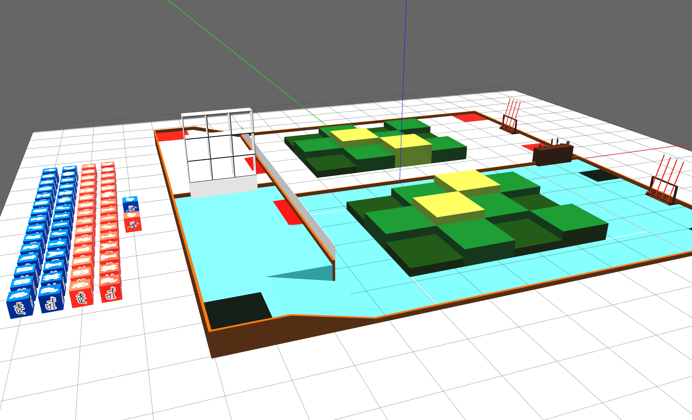

# RC2026 Gazebo Classic 仿真场地功能包




根据重邮开源的blender场地文件, 将场地导出为.dae格式, 并添加到gazebo classic中, KFS模型根据贴图由脚本自动生成
> 注意本场地功能包仅在ROS2 humble 以及 gazebo classic下测试通过, 其他ROS2版本未测试

# 场地模型说明
本项目使用了重庆邮电大学 HXC 战队提供的Robocon 2026比赛场地模型, 进行了部分删改

# 快速开始
1. 编译项目
```bash
colcon build --packages-select rc2026_field
source install/setup.bash
```

2. 启动仿真
```bash
ros2 launch rc2026_field rc2026_field_sim.launch.py
```

# TODO
- 功能增加: 场地每次加载自动随机按照规则在梅林随机放置KFS, 支持yaml简单配置
- 功能增加: 场地每次加载自动随机按照规则在武馆九宫格随机放置KFS, 支持yaml简单配置

# 调整说明

- 修正了RC2026场地梅林场地摆放错误
- 将武馆的九宫格边框贴上黑色亚光乙烯胶带
- 删除了广告牌与文字

