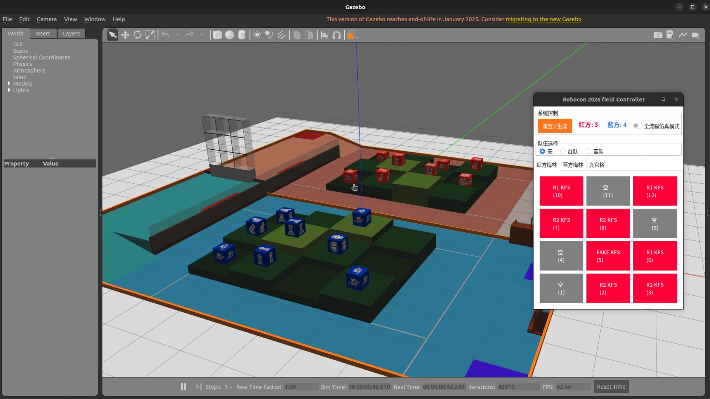
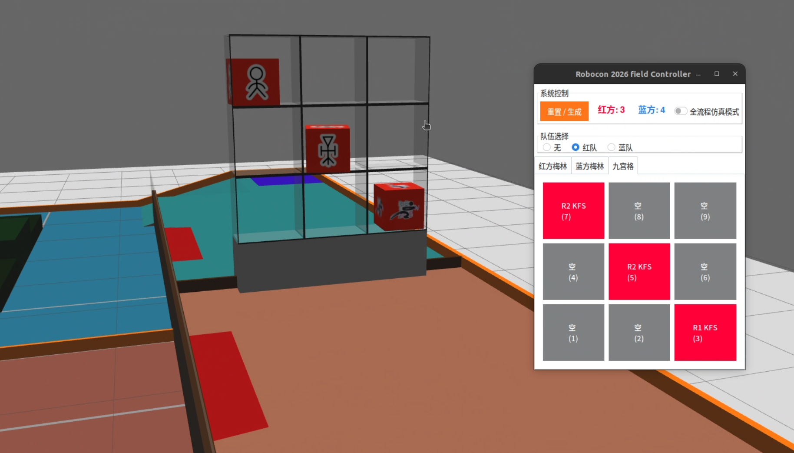

# RC2026 Gazebo Classic 仿真场地功能包


- 本项目的场地模型基于重邮开源的blender场地文件,
主要思路是将场地导出为.dae格式, 并添加到gazebo classic中, KFS模型根据贴图由脚本自动生成

> 注意本场地功能包仅在ROS2 humble 以及 gazebo classic下测试通过, 其他ROS2版本未测试


## 快速开始
1. 安装依赖
```bash
pip install ttkbootstrap
```

2. 编译项目
```bash
colcon build --packages-select rc2026_field
source install/setup.bash
```

3. 启动仿真 

- 启动场地仿真 + GUI 控制
```bash
ros2 launch rc2026_field rc2026_field_sim_with_controller.launch.py
```

- 仅启动场地仿真
```bash
ros2 launch rc2026_field rc2026_field_sim.launch.py
```

## GUI控制功能介绍
### 通过点击GUI的对应梅林方块可进行移除操作


### 九宫格KFS的放置
需要先选择队伍, 然后再通过点击对应的格子执行放置本队KFS的操作

武器可以用于攻击另外一队的KFS, 通过点击另一队已有KFS的格子执行攻击操作, 会消耗本队的武器数量



### 全流程仿真设置说明
开了之后, 在九宫格放置的KFS来源于已经在梅林拾取的KFS, 若是独立模式, 则没有这个限制(无需先拾取梅林中的KFS)
## 关键配置参数
配置文件路径: `config/kfs_config.yaml`

| 参数项 | 说明 | 关键子项 |
| :--- | :--- | :--- |
| **inventory** | 库存配置 | `num_r1`(R1 KFS数), `num_r2_true`(R2 KFS数), `num_fake`(FAKE KFS数) |
| **grid** | 九宫格生成 | `base_x/y`(中心坐标), `pitch_x/z`(间距), `random_range_*`(随机偏移量) |
详细配置请参考配置文件内的注释。

## API说明
简单测试用了topic, 因为本项目是ament_python, 导致加个srv的话点麻烦)

主要功能是放置/移除KFS,以及查询当前场上KFS分布情况

详情请看`API.md`

## scripts目录下的脚本说明

- `kill_gazebo.sh`: 用于杀掉gazebo classic的进程
- `random_kfs_in_MF.py`: 用于随机生成梅林区的KFS
- `random_kfs_in_grid.py`: 用于随机生成九宫格的KFS
- `random_all.py`: 用于随机生成所有KFS

## 场地模型说明

本项目使用了重庆邮电大学 HXC 战队提供的Robocon 2026比赛场地模型, 进行了部分删改

- 修正了RC2026场地梅林场地摆放错误
- 将武馆的九宫格边框贴上黑色亚光乙烯胶带
- 删除了广告牌与文字
- 修复dae文件材质错误


